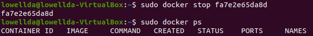
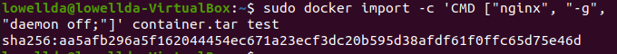

# Отчёт

## Part 1

##### - Берем официальный докер образ с nginx и выкачиваем его при помощи docker pull

##### - Проверяем наличие докер образа через docker images

##### - Запускаем докер образ через docker run -d 

##### - Проверяем, что образ запустился через docker ps

##### - По выводу команды docker inspect определяем размер контейнера, список замапленных портов и ip контейнера

##### - Остановливаем докер образ через docker stop и проверяем, что образ остановился через docker ps

##### - Запускаем докер с замапленными портами 80 и 443 на локальную машину через команду run

##### - Проверяем, что в браузере по адресу localhost:80 доступна стартовая страница nginx

##### - Перезапускаем докер контейнер через docker restart и проверяем, что контейнер запустился

## Part 2

##### - Читаем конфигурационный файл nginx.conf внутри докер контейнера через команду exec

##### - Создаем на локальной машине файл nginx.conf и настраиваем в нем по пути /status отдачу страницы статуса сервера nginx

##### - Копируем созданный файл nginx.conf внутрь докер образа через команду docker cp

##### - Перезапускаем nginx внутри докер образа через команду exec

##### - Проверяем, что по адресу localhost:80/status отдается страничка со статусом сервера nginx

##### - Экспортируем контейнер в файл container.tar через команду export

##### - Остановливаем контейнер и удаляем образ через docker rmi, не удаляя перед этим контейнеры

##### - Удаляем остановленный контейнер

##### - Импортируем контейнер обратно через команду import

##### - Запускаем импортированный контейнер

##### - Проверяем, что по адресу localhost:80/status отдается страничка со статусом сервера nginx

## Part 3